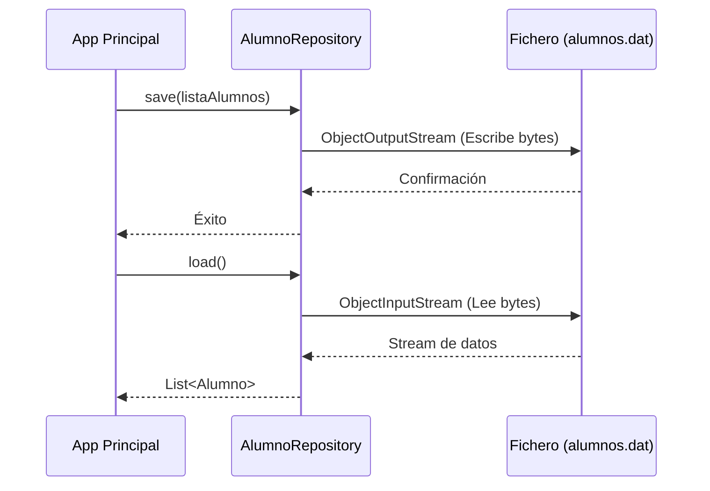

En este tutorial construiremos un sistema capaz de guardar y recuperar una lista de alumnos en un fichero binario. Utilizaremos el patrón **Repository** para separar la gestión de datos del resto de la aplicación.

## 1. Prerrequisitos

Asegúrate de tener configurado tu proyecto Maven con la versión de Java 17 o superior. No necesitaremos dependencias externas para este tutorial básico, ya que usaremos las librerías nativas de Java.

## 2. Diagrama de Arquitectura

El flujo de información seguirá este esquema:



## 3. Implementación Paso a Paso

### 3.1. Modelo de Datos (Serializable)
Lo primero es crear nuestra clase de entidad. Es vital que implemente `Serializable`.

```java title="java/com/dam/ad/model/Alumno.java"
package com.dam.ad.model;

import java.io.Serializable;

public class Alumno implements Serializable {
    // ID de versión para control de cambios en la clase
    private static final long serialVersionUID = 1L;
    
    private String nombre;
    private int edad;
    private transient String contraseña; // No se guardará en disco

    public Alumno(String nombre, int edad, String contraseña) {
        this.nombre = nombre;
        this.edad = edad;
        this.contraseña = contraseña;
    }

    @Override
    public String toString() {
        return "Alumno{nombre='" + nombre + "', edad=" + edad + "}";
    }
}
```

### 3.2. El Repositorio de Alumnos
Esta clase se encarga de la lógica de persistencia.

```java title="java/com/dam/ad/repository/AlumnoRepository.java"
package com.dam.ad.repository;

import com.dam.ad.model.Alumno;
import java.io.*;
import java.util.ArrayList;
import java.util.List;

public class AlumnoRepository {
    private final String PATH = "datos/alumnos.dat";

    public void save(List<Alumno> alumnos) {
        // Try-with-resources asegura el cierre de los flujos
        try (ObjectOutputStream oos = new ObjectOutputStream(new FileOutputStream(PATH))) {
            oos.writeObject(alumnos);
        } catch (IOException e) {
            System.err.println("Error al guardar: " + e.getMessage());
        }
    }

    @SuppressWarnings("unchecked")
    public List<Alumno> load() {
        File file = new File(PATH);
        if (!file.exists()) return new ArrayList<>();

        try (ObjectInputStream ois = new ObjectInputStream(new FileInputStream(PATH))) {
            return (List<Alumno>) ois.readObject();
        } catch (IOException | ClassNotFoundException e) {
            System.err.println("Error al cargar: " + e.getMessage());
            return new ArrayList<>();
        }
    }
}
```

## 4. Prueba del Sistema

Finalmente, creamos una clase principal para verificar que todo funciona.

```java title="java/com/dam/ad/Main.java"
package com.dam.ad;

import com.dam.ad.model.Alumno;
import com.dam.ad.repository.AlumnoRepository;
import java.util.List;

public class Main {
    public static void main(String[] args) {
        AlumnoRepository repo = new AlumnoRepository();

        // 1. Crear y guardar
        List<Alumno> lista = List.of(
            new Alumno("Pepe", 20, "1234"),
            new Alumno("Maria", 22, "abcd")
        );
        repo.save(lista);
        System.out.println("Datos guardados.");

        // 2. Cargar y mostrar
        List<Alumno> recuperados = repo.load();
        recuperados.forEach(System.out::println);
    }
}
```

---

:::tip Actividad Propuesta
Intenta modificar el `AlumnoRepository` para que en lugar de usar serialización de objetos, guarde los datos en un fichero de texto plano separado por comas (CSV).
:::
