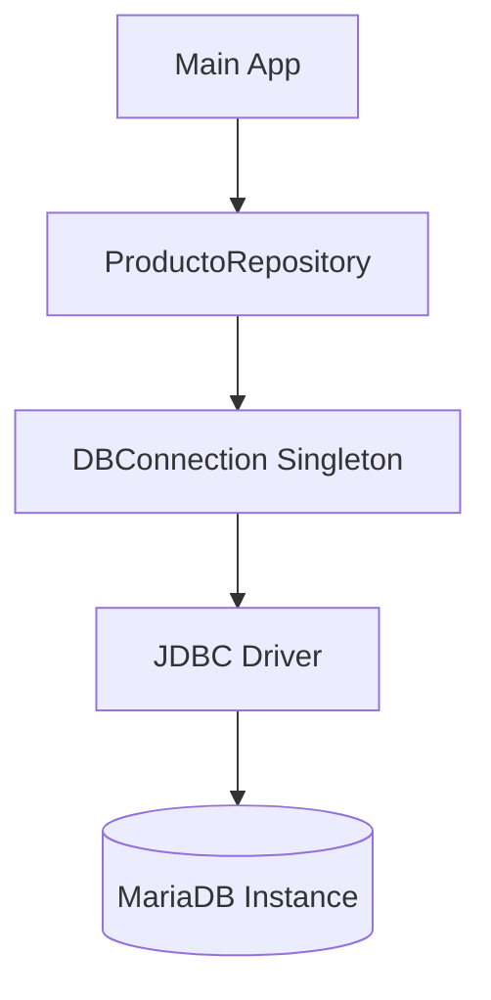

En este tutorial implementaremos una capa de persistencia completa para gestionar una tabla de `Productos` en una base de datos relacional.

## 1. Prerrequisitos

Necesitarás un servidor de base de datos (MariaDB o MySQL) y añadir la siguiente dependencia a tu `pom.xml`:

```xml title="pom.xml"
<dependency>
    <groupId>org.mariadb.jdbc</groupId>
    <artifactId>mariadb-java-client</artifactId>
    <version>3.1.2</version>
</dependency>
```

## 2. Diagrama de Arquitectura

Separaremos la lógica de conexión de la lógica de negocio mediante un **Singleton** para la base de datos y el patrón **Repository**.



## 3. Implementación Paso a Paso

### 3.1. Base de Datos
Crea la tabla necesaria ejecutando este script en tu gestor de BD:

```sql title="schema.sql"
CREATE DATABASE IF NOT EXISTS tienda;
USE tienda;

CREATE TABLE productos (
    id INT AUTO_INCREMENT PRIMARY KEY,
    nombre VARCHAR(100) NOT NULL,
    precio DECIMAL(10,2) NOT NULL,
    stock INT DEFAULT 0
);
```

### 3.2. Gestión de la Conexión (Singleton)
Para evitar abrir y cerrar conexiones constantemente de forma ineficiente.

```java title="java/com/dam/ad/db/DBConnection.java"
package com.dam.ad.db;

import java.sql.Connection;
import java.sql.DriverManager;
import java.sql.SQLException;

public class DBConnection {
    private static Connection connection = null;
    private static final String URL = "jdbc:mariadb://localhost:3306/tienda";
    private static final String USER = "root";
    private static final String PASS = "password";

    public static Connection getConnection() throws SQLException {
        if (connection == null || connection.isClosed()) {
            connection = DriverManager.getConnection(URL, USER, PASS);
        }
        return connection;
    }
}
```

### 3.3. Repositorio de Productos (CRUD)
Aquí es donde usamos `PreparedStatement` para todas las operaciones.

```java title="java/com/dam/ad/repository/ProductoRepository.java"
package com.dam.ad.repository;

import com.dam.ad.db.DBConnection;
import com.dam.ad.model.Producto;
import java.sql.*;
import java.util.ArrayList;
import java.util.List;

public class ProductoRepository {

    public void insert(Producto p) {
        String sql = "INSERT INTO productos (nombre, precio, stock) VALUES (?, ?, ?)";
        try (PreparedStatement ps = DBConnection.getConnection().prepareStatement(sql)) {
            ps.setString(1, p.getNombre());
            ps.setDouble(2, p.getPrecio());
            ps.setInt(3, p.getStock());
            ps.executeUpdate();
        } catch (SQLException e) {
            e.printStackTrace();
        }
    }

    public List<Producto> findAll() {
        List<Producto> lista = new ArrayList<>();
        String sql = "SELECT * FROM productos";
        try (Statement st = DBConnection.getConnection().createStatement();
             ResultSet rs = st.executeQuery(sql)) {
            
            while (rs.next()) {
                lista.add(new Producto(
                    rs.getInt("id"),
                    rs.getString("nombre"),
                    rs.getDouble("precio"),
                    rs.getInt("stock")
                ));
            }
        } catch (SQLException e) {
            e.printStackTrace();
        }
        return lista;
    }
}
```

---

:::info Tarea para el alumno
Añade los métodos `update(Producto p)` y `delete(int id)` al repositorio siguiendo el mismo patrón de `PreparedStatement`.
:::

:::tip
Recuerda configurar correctamente las credenciales de tu base de datos en la clase `DBConnection` para que el código pueda conectar con éxito.
:::
