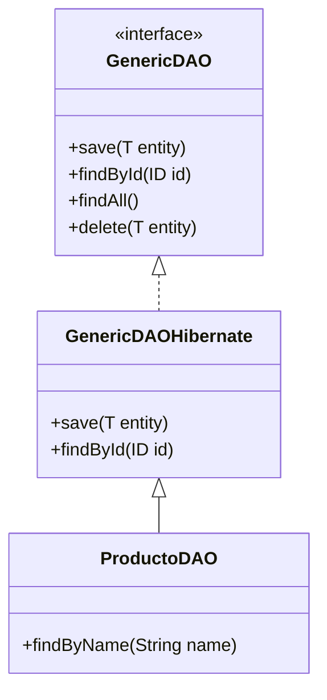

En este tutorial aprenderemos a crear una estructura de persistencia profesional que evita la duplicación de código mediante el uso de **Genéricos** y el patrón **DAO**.

## 1. Prerrequisitos

Este tutorial asume que ya tienes configurado Hibernate en tu proyecto (ver UT03). Utilizaremos las clases estándar de JPA/Hibernate.

## 2. Diagrama de Arquitectura

El objetivo es que todos nuestros DAOs compartan la misma lógica base, de modo que solo tengamos que programar las consultas específicas.



## 3. Implementación Paso a Paso

### 3.1. La Interfaz Genérica
Define el contrato mínimo que todos nuestros componentes de datos deben cumplir.

```java title="java/com/dam/ad/dao/GenericDAO.java"
package com.dam.ad.dao;

import java.util.List;

public interface GenericDAO<T, ID> {
    void save(T entity);
    void update(T entity);
    void delete(T entity);
    T findById(ID id);
    List<T> findAll();
}
```

### 3.2. Implementación Base (Hibernate)
Aquí escribimos el código de Hibernate una sola vez.

```java title="java/com/dam/ad/dao/GenericDAOHibernate.java"
package com.dam.ad.dao;

import com.dam.ad.util.HibernateUtil;
import org.hibernate.Session;
import org.hibernate.Transaction;
import java.util.List;

public abstract class GenericDAOHibernate<T, ID> implements GenericDAO<T, ID> {
    private final Class<T> type;

    public GenericDAOHibernate(Class<T> type) {
        this.type = type;
    }

    @Override
    public void save(T entity) {
        try (Session session = HibernateUtil.getSessionFactory().openSession()) {
            Transaction tx = session.beginTransaction();
            session.persist(entity);
            tx.commit();
        }
    }

    @Override
    public T findById(ID id) {
        try (Session session = HibernateUtil.getSessionFactory().openSession()) {
            return session.get(type, (java.io.Serializable) id);
        }
    }
    
    // Implementar el resto de métodos...
}
```

### 3.3. Uso de un DAO Concreto
Ahora, crear un nuevo DAO para `Cliente` es tan simple como esto:

```java title="java/com/dam/ad/dao/ClienteDAO.java"
package com.dam.ad.dao;

import com.dam.ad.model.Cliente;

public class ClienteDAO extends GenericDAOHibernate<Cliente, Long> {
    public ClienteDAO() {
        super(Cliente.class);
    }
    
    // Aquí solo añadimos métodos que NO sean CRUD básicos
    public Cliente findByDni(String dni) {
        // Lógica específica con HQL...
        return null; 
    }
}
```

---

:::tip
Al usar esta arquitectura, si mañana decides cambiar Hibernate por otra tecnología, solo tendrás que crear una nueva clase `GenericDAO_NuevaTecnologia` y tus DAOs concretos apenas sufrirán cambios.
:::

:::important
Recuerda siempre gestionar correctamente las sesiones y transacciones. En aplicaciones web reales, esto se suele delegar en un contenedor (como Spring) mediante la anotación `@Transactional`.
:::
