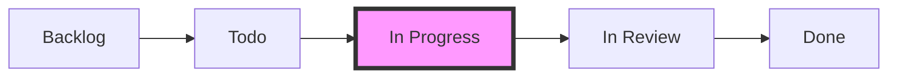

En la actualidad, herramientas como **GitHub Projects** permiten integrar la gestión de tareas directamente con el código fuente, facilitando el flujo de trabajo "Docs-as-Code".

## Objetivos del Tutorial

1.  Crear un proyecto en GitHub.
2.  Configurar un tablero Kanban profesional.
3.  Gestionar el ciclo de vida de una tarea (Issue).

## Paso 1: Creación del Proyecto

1.  Accede a tu cuenta de GitHub.
2.  En la barra superior, haz clic en el icono `+` y selecciona **New project**.
3.  Selecciona la plantilla **Board** (Tablero).
4.  Dale un nombre a tu proyecto, por ejemplo: `Desarrollo App E-learning`.

## Paso 2: Configuración de Columnas (Flujo de Trabajo)

Un tablero Kanban profesional suele tener más que "Hacer" y "Hecho". Configura las siguientes columnas:

-   **Backlog**: Tareas pendientes a largo plazo.
-   **Todo**: Tareas seleccionadas para empezar pronto.
-   **In Progress**: Tareas que se están desarrollando actualmente.
-   **In Review**: Código terminado esperando revisión de un compañero (Pull Request).
-   **Done**: Tareas finalizadas y verificadas.

## Paso 3: Gestión de Tareas (Issues)

En GitHub, las tareas se representan como **Issues**.

1.  Haz clic en `+ Add item` en la columna Backlog.
2.  Escribe el título de la tarea (ej: `Configurar entorno Java`).
3.  Convierte el item en una **Issue** seleccionando tu repositorio.
4.  Añade etiquetas (Labels) como `bug`, `feature` o `documentation`.

## Paso 4: El Flujo de Trabajo Diario

A medida que avances en el módulo ED, deberás mover tus tareas:
1.  Mueve la tarea de `Todo` a `In Progress` cuando empieces a programar.
2.  Usa el límite de **WIP**: Intenta no tener más de 2 tareas en `In Progress` simultáneamente para evitar la multitarea ineficiente.
3.  Cuando termines, muévela a `Done`.

> [!IMPORTANT]
> Recuerda que un tablero Kanban no es solo una lista de tareas, es una herramienta visual para detectar dónde se atasca el trabajo del equipo.
