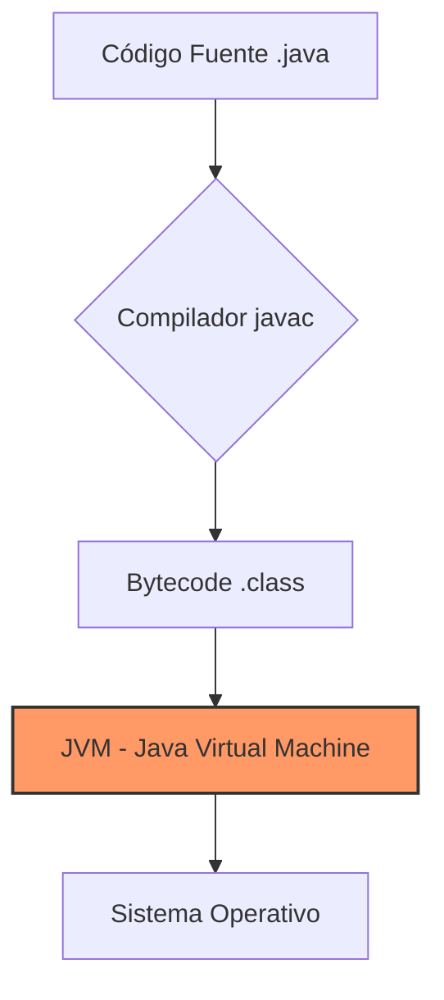

El entorno de desarrollo es el "taller" del programador. Elegir y configurar correctamente estas herramientas es vital para la productividad y la calidad del código.

## 1. ¿Qué es un IDE?

Un **Integrated Development Environment (IDE)** es una aplicación que proporciona servicios integrales para facilitar el desarrollo de software. A diferencia de un simple editor de texto (como Notepad++), un IDE combina:

-   **Editor de código**: Con resaltado de sintaxis y autocompletado (IntelliSense).
-   **Depurador (Debugger)**: Para ejecutar el código paso a paso y encontrar errores.
-   **Herramientas de construcción (Build Tools)**: Para compilar y empaquetar el software.
-   **Integración con Control de Versiones**: Soporte nativo para Git.

### IDEs Populares en Java
1.  **IntelliJ IDEA**: El estándar de la industria actual por su potente análisis de código.
2.  **Eclipse**: Clásico, altamente extensible mediante plugins.
3.  **Visual Studio Code**: Editor ligero que, con las extensiones adecuadas, funciona como un IDE.

## 2. El Ecosistema Java: JDK vs JRE

Para desarrollar en Java, es fundamental entender la diferencia entre estos componentes:

-   **JRE (Java Runtime Environment)**: Contiene la JVM (Java Virtual Machine) y las librerías necesarias para *ejecutar* programas Java.
-   **JDK (Java Development Kit)**: Es un superconjunto del JRE. Incluye herramientas para *desarrollar*, como el compilador (`javac`), el generador de documentación (`javadoc`) y el depurador.

> [!IMPORTANT]
> Como desarrolladores, siempre instalaremos el **JDK**. Se recomienda usar versiones LTS (Long Term Support) como Java 17 o Java 21.

## 3. Automatización de Construcción: Maven y Gradle

En proyectos profesionales no compilamos archivos `.java` a mano. Utilizamos herramientas que gestionan las dependencias (librerías externas) y el ciclo de vida del proyecto:

-   **Maven**: Basado en archivos `pom.xml`. Sigue la filosofía de "convención sobre configuración".
-   **Gradle**: Más moderno y flexible, utiliza scripts basados en Groovy o Kotlin.

## 4. Personalización y Productividad

Un buen entorno de desarrollo debe estar adaptado al programador:
-   **Temas Visuales**: Modos oscuros para reducir la fatiga visual.
-   **Linters**: Herramientas que analizan el código en tiempo real para sugerir mejoras (ej: Checkstyle, SonarLint).
-   **Atajos de teclado**: El uso intensivo del teclado en lugar del ratón multiplica la velocidad de desarrollo.
