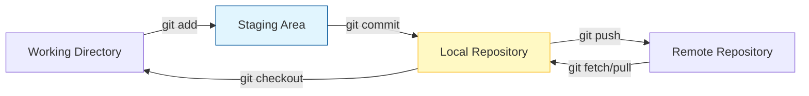

El control de versiones es el "seguro de vida" del desarrollador. Permite registrar cambios, colaborar en equipo y revertir errores sin perder trabajo.

## 1. ¿Por qué Git?

Git es un **DVCS (Distributed Version Control System)**. A diferencia de los sistemas centralizados, cada desarrollador tiene una copia completa del historial del proyecto en su máquina local.

### Ventajas clave:
-   **Velocidad**: Casi todas las operaciones son locales.
-   **Integridad**: Usa hashes (SHA-1) para garantizar que los datos no se corrompan.
-   **Ramificación (Branching)**: Crear ramas para nuevas funciones es casi instantáneo.

## 2. Arquitectura de Git: Las Tres Áreas

Para entender Git, es vital comprender dónde residen los archivos en cada momento:

1.  **Working Directory**: La carpeta donde estás editando los archivos.
2.  **Staging Area (Index)**: Un área intermedia donde preparas los archivos que irán en el próximo "snapshot".
3.  **Repository (Local .git)**: Donde Git guarda permanentemente las versiones del proyecto.

## 3. Conceptos Fundamentales

-   **Commit**: Un "snapshot" de los archivos en un momento dado. Cada commit tiene un mensaje descriptivo y un autor.
-   **Branch (Rama)**: Una línea de desarrollo independiente. La rama principal suele llamarse `main` o `master`.
-   **Merge**: Fusión de los cambios de una rama en otra.
-   **Conflictos**: Ocurren cuando dos personas modifican la misma línea del mismo archivo y Git no sabe cuál elegir.

## 4. Estrategias de Trabajo: GitFlow

En entornos profesionales se utilizan protocolos para organizar las ramas:

-   **Main**: Código siempre estable y listo para producción.
-   **Develop**: Rama principal de integración para el desarrollo.
-   **Feature branches**: Ramas temporales para desarrollar funcionalidades específicas.
-   **Hotfixes**: Ramas rápidas para corregir errores críticos en producción.

> [!IMPORTANT]
> Un buen desarrollador realiza **commits pequeños y frecuentes** con mensajes claros (ej: `feat: add login validation`). Evita commits gigantes titulados "cambios" o "arreglos".
