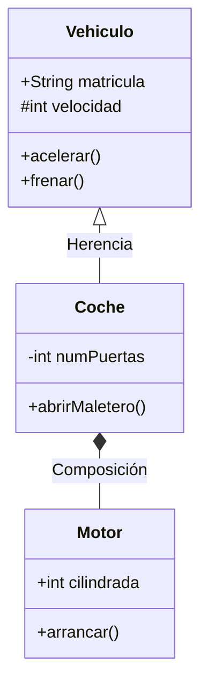

El **Unified Modeling Language (UML)** es el estándar de la industria para visualizar, especificar y documentar sistemas de software. El diagrama de clases es el más importante del modelado estático.

## 1. La Clase: Anatomía y Visibilidad

Una clase representa un conjunto de objetos que comparten las mismas características. Se divide en tres secciones:

1.  **Nombre**: Identificador de la clase (UpperCamelCase).
2.  **Atributos**: Datos o propiedades de la clase.
3.  **Métodos (Operaciones)**: Comportamientos o funciones.

### Visibilidad de Miembros
Se indica mediante símbolos delante del nombre:
-   `+` **Público**: Accesible desde cualquier clase.
-   `-` **Privado**: Solo accesible desde la propia clase.
-   `#` **Protegido**: Accesible desde la clase y sus descendientes (herencia).
-   `~` **Paquete**: Accesible desde cualquier clase del mismo paquete.

## 2. Tipos de Relaciones

Lo más potente de UML es definir cómo interactúan las clases entre sí.

### Herencia (Generalización)
Representa una relación de tipo "es un". Una clase hija hereda atributos y métodos de una clase padre.
-   *Símbolo*: Flecha con punta triangular vacía apuntando al padre.

### Asociación
Relación simple entre dos clases. Puede ser unidireccional o bidireccional.
-   *Símbolo*: Línea continua.

### Agregación y Composición
Ambas representan una relación "tiene un" o "es parte de".
-   **Agregación**: El ciclo de vida de la parte es independiente del todo (ej: Coche y Ruedas). *Rombo vacío*.
-   **Composición**: La parte no puede existir sin el todo (ej: Edificio y Habitaciones). *Rombo lleno*.

### Interfaz (Realización)
Define un contrato que una clase debe cumplir.
-   *Símbolo*: Línea discontinua con punta triangular vacía.

## 3. Multiplicidad

Indica cuántos objetos de una clase pueden estar relacionados con un objeto de la otra clase:
-   `1`: Exactamente uno.
-   `0..1`: Cero o uno.
-   `*`: Muchos.
-   `1..*`: Uno o muchos.

> [!TIP]
> No intentes modelar cada detalle del código en el diagrama. El objetivo es que una persona entienda la arquitectura del sistema de un vistazo.
