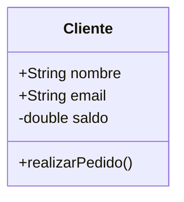
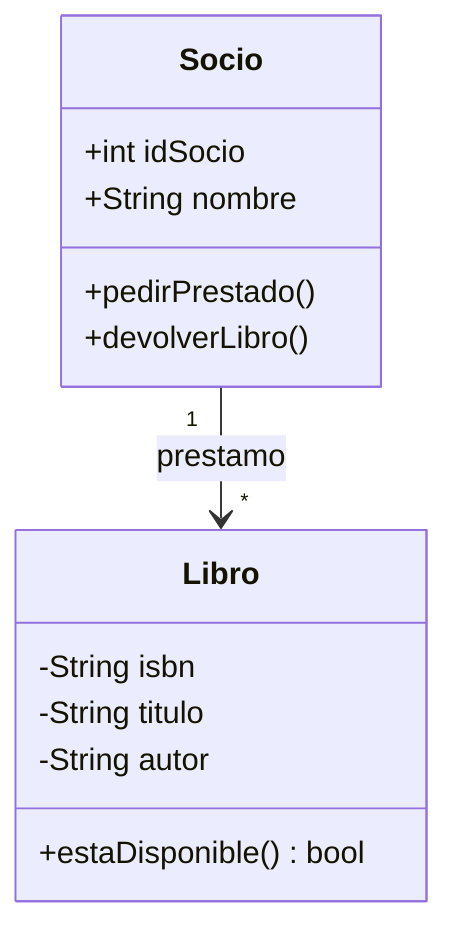

En el paradigma **Docs-as-Code**, preferimos herramientas que generen diagramas a partir de texto. **Mermaid** es la opción estándar soportada por GitHub y Docusaurus.

## Paso 1: Estructura Básica de una Clase

Para definir una clase en Mermaid, usamos la palabra clave `class`.

**Sintaxis utilizada**:
-   `classDiagram`: Indica el tipo de diagrama.
-   `+`: Público.
-   `-`: Privado.

## Paso 2: Representación de Relaciones

Mermaid utiliza diferentes flechas para los tipos de relaciones:

| Relación | Sintaxis | Símbolo |
| :--- | :--- | :--- |
| **Herencia** | `&lt;|--` | Flecha vacía |
| **Composición** | `*--` | Rombo lleno |
| **Agregación** | `o--` | Rombo vacío |
| **Asociación** | `-->` | Flecha abierta |

## Paso 3: Ejercicio Práctico - Sistema de Biblioteca

Vamos a modelar un sistema sencillo. Sigue estos pasos para construir el código Mermaid:

1.  Define una clase `Libro` con atributos privados `titulo`, `autor` e `isbn`.
2.  Define una clase `Socio` que pueda `pedirPrestado()`.
3.  Establece una relación de **Asociación** donde un `Socio` puede tener muchos `Libros`.

## Paso 4: Exportación y Herramientas Externas

Aunque Mermaid es excelente para documentación, a veces necesitarás herramientas visuales más potentes:

1.  **Mermaid Live Editor**: Para previsualizar y exportar a PNG/SVG.
2.  **StarUML**: Software profesional (descargable) para modelado avanzado.
3.  **PlantUML**: Otra alternativa basada en texto muy común en el entorno Java.

> [!IMPORTANT]
> Mantén tus diagramas actualizados. Si cambias el nombre de una clase en el código, asegúrate de reflejarlo en la documentación.
