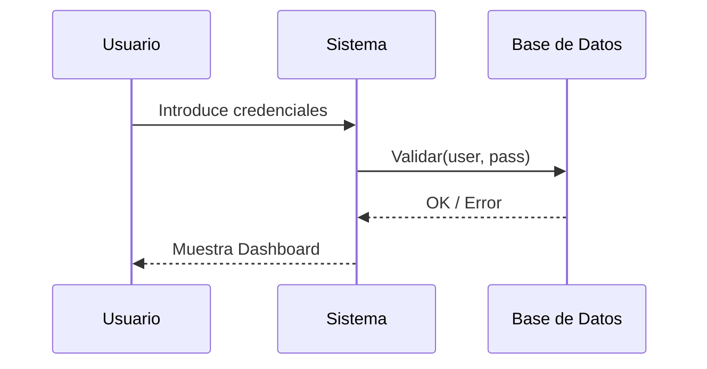

Mientras que el diagrama de clases muestra *qué hay* en el sistema, los diagramas de comportamiento muestran *qué ocurre* y cómo interactúan las partes.

## 1. Diagramas de Casos de Uso

Representan las funcionalidades del sistema desde el punto de vista del usuario (o sistemas externos).

-   **Actor**: Entidad externa que interactúa con el sistema (Usuario, Administrador, Sensor).
-   **Caso de Uso**: Una función específica (ej: "Registrar usuario").
-   **Límite del Sistema**: Un rectángulo que encierra los casos de uso.

### Relaciones en Casos de Uso
-   **Include**: El caso de uso A *siempre* incluye al B (ej: Pagar incluye Validar Tarjeta).
-   **Extend**: El caso de uso B es una opción *opcional* o excepcional del A (ej: Pagar extiende Aplicar Descuento).

## 2. Diagramas de Secuencia

Muestran la interacción entre objetos a lo largo del tiempo para una tarea específica.

-   **Línea de Vida (Lifeline)**: Representa el tiempo que el objeto está activo.
-   **Mensajes**: Flechas que indican llamadas a métodos.
    -   *Sincrónicos*: Flecha con punta llena (espera respuesta).
    -   *Asincrónicos*: Flecha con punta abierta.
    -   *Respuesta*: Línea discontinua.

## 3. Diagramas de Actividad

Son similares a los diagramas de flujo. Muestran la lógica de un proceso o algoritmo.

-   **Nodos de Inicio/Fin**: Puntos de entrada y salida.
-   **Acciones**: Rectángulos con bordes redondeados.
-   **Decisiones (Gemas)**: Rombos que bifurcan el flujo según una condición.
-   **Forks/Joins**: Barras negras que permiten representar flujos en paralelo.

> [!IMPORTANT]
> Un diagrama de secuencia es excelente para entender por qué manos pasa la información, mientras que el de actividad es mejor para entender la lógica interna (ifs, loops) de una función.
