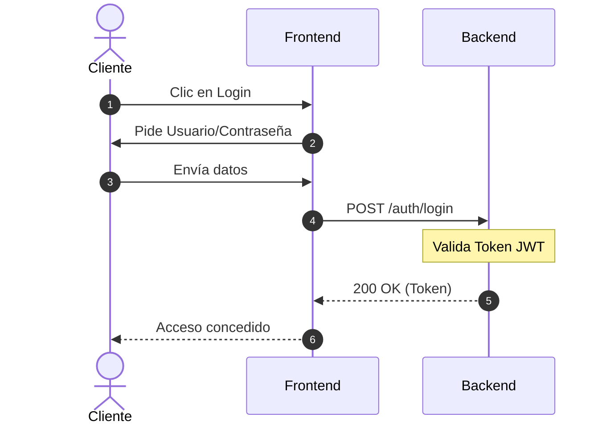
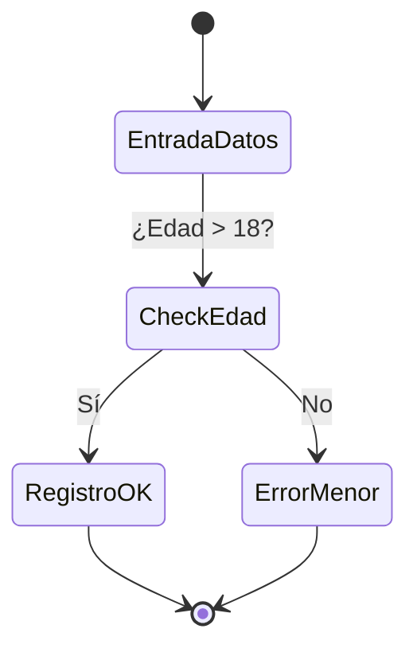
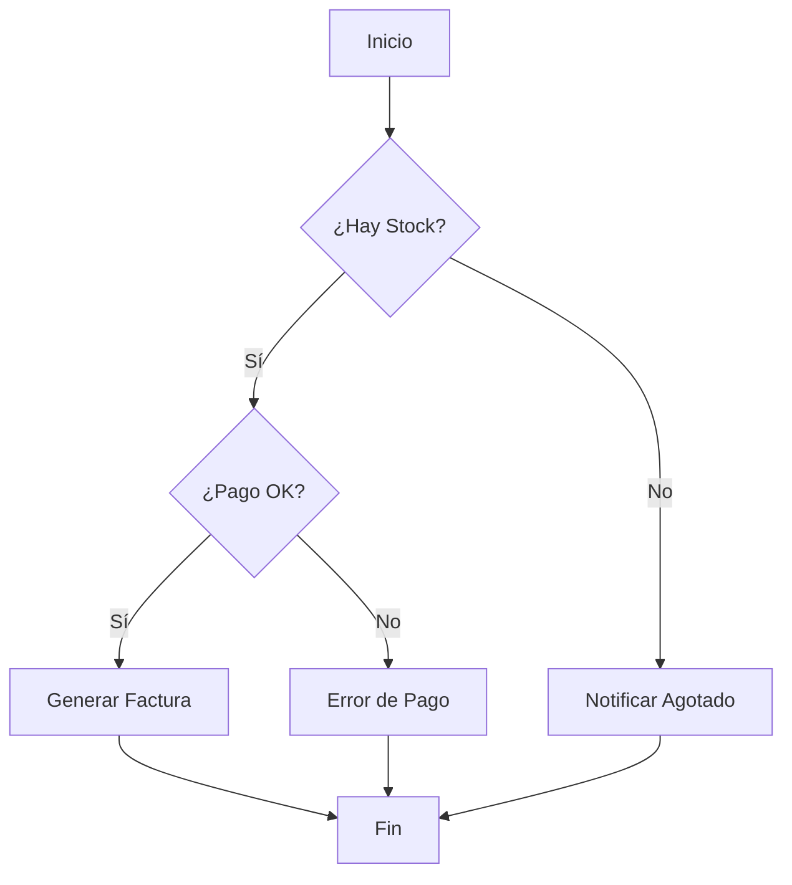

En este tutorial aprenderás a representar la lógica de una aplicación mediante diagramas de comportamiento basados en texto.

## Paso 1: Diagramas de Secuencia

Los diagramas de secuencia son ideales para documentar cómo interactúa tu frontend con el backend y la base de datos.

**Ejercicio: Proceso de Login**

**Claves del diagrama**:
-   `autonumber`: Añade numeración automática a los pasos.
-   `Note over`: Permite añadir explicaciones técnicas.

## Paso 2: Diagramas de Actividad

Úsalos para documentar la lógica de un método complejo.

**Ejercicio: Validación de Edad**

## Paso 3: Reto Práctico - Sistema de Pedidos

Crea un diagrama de actividad para el siguiente proceso:
1.  El usuario selecciona un producto.
2.  El sistema comprueba el stock.
3.  **Si hay stock**: Se procesa el pago.
    -   Si el pago es correcto, se genera la factura.
    -   Si el pago falla, se muestra error.
4.  **Si no hay stock**: Se informa al usuario.

> [!TIP]
> Mermaid permite usar `flowchart` para diagramas de actividad más flexibles que los `stateDiagram`. En la mayoría de casos técnicos, `flowchart` es más intuitivo.
