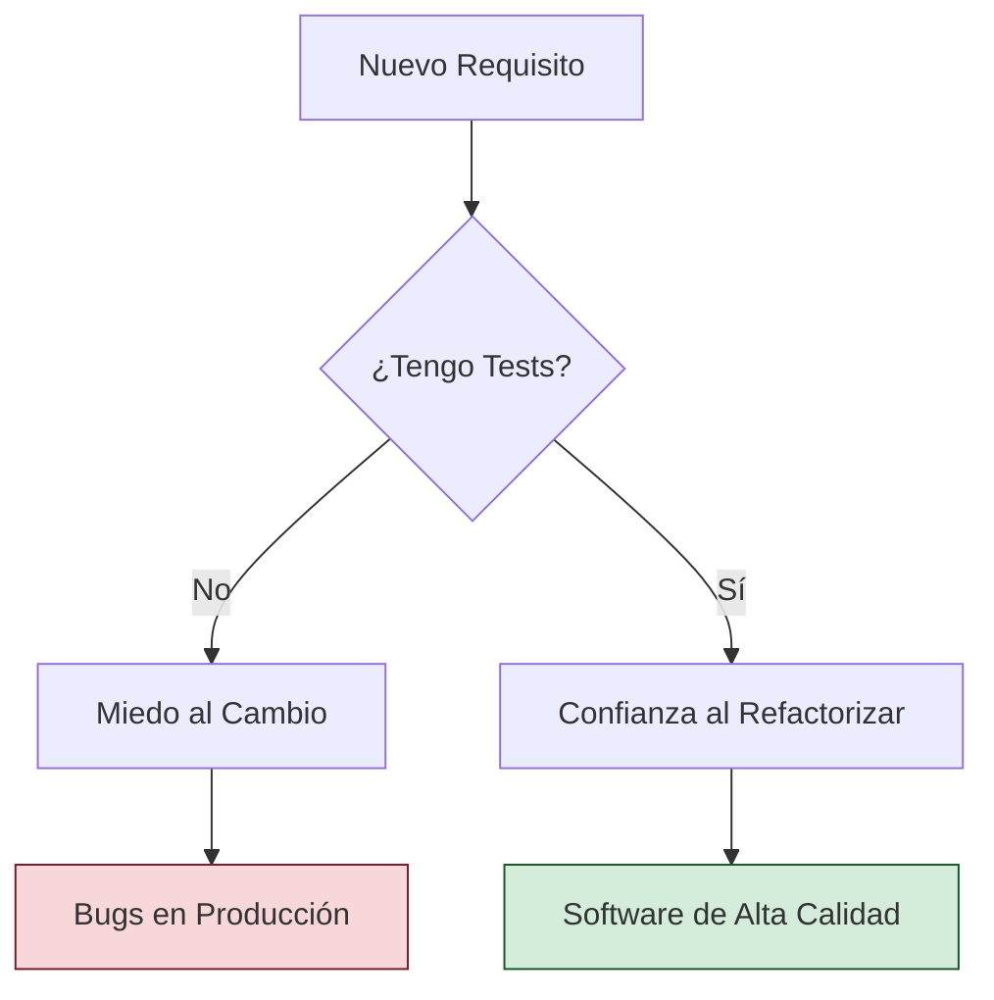

El testing no es una fase opcional; es parte integral del desarrollo. Un software sin pruebas es un software que fallará en producción.

## 1. Niveles de Prueba

Según el alcance de lo que estamos probando, distinguimos:

-   **Pruebas Unitarias**: Verifican el funcionamiento de un método o clase de forma aislada. Son las más rápidas y baratas.
-   **Pruebas de Integración**: Verifican que varios componentes funcionan bien juntos (ej: App + Base de Datos).
-   **Pruebas de Sistema**: Prueban la aplicación completa en un entorno similar al real.
-   **Pruebas de Aceptación (UAT)**: Realizadas por el cliente para validar que se cumple lo pactado.

## 2. Estrategias de Testing

### Caja Negra vs Caja Blanca
-   **Caja Negra**: Probamos la funcionalidad sin conocer el código interno (entradas y salidas).
-   **Caja Blanca**: Probamos la lógica interna, asegurándonos de recorrer todos los caminos (ifs, loops).

### TDD: Test Driven Development
Es una metodología donde escribes el test *antes* del código.
1.  **Red**: Escribes un test que falla.
2.  **Green**: Escribes el código mínimo para que el test pase.
3.  **Refactor**: Mejoras el código manteniendo los tests en verde.

## 3. Calidad de Código y Deuda Técnica

La calidad no solo es "que funcione", sino que sea fácil de leer y cambiar.

-   **Code Coverage**: Porcentaje de líneas de código ejecutadas por los tests. Se recomienda un 80% o superior.
-   **Análisis Estático**: Herramientas que buscan errores sin ejecutar el código (ej: duplicados, variables no usadas).
-   **Deuda Técnica**: El coste de elegir soluciones rápidas pero malas en lugar de soluciones robustas. Si no se paga (refactorizando), el proyecto se vuelve inmantenible.

> [!IMPORTANT]
> Una prueba unitaria debe ser **FAST**: Frist (Rápida), Isolated (Aislada), Repeatable (Repetible), Self-validating (Auto-validable) y Timely (Oportuna).
