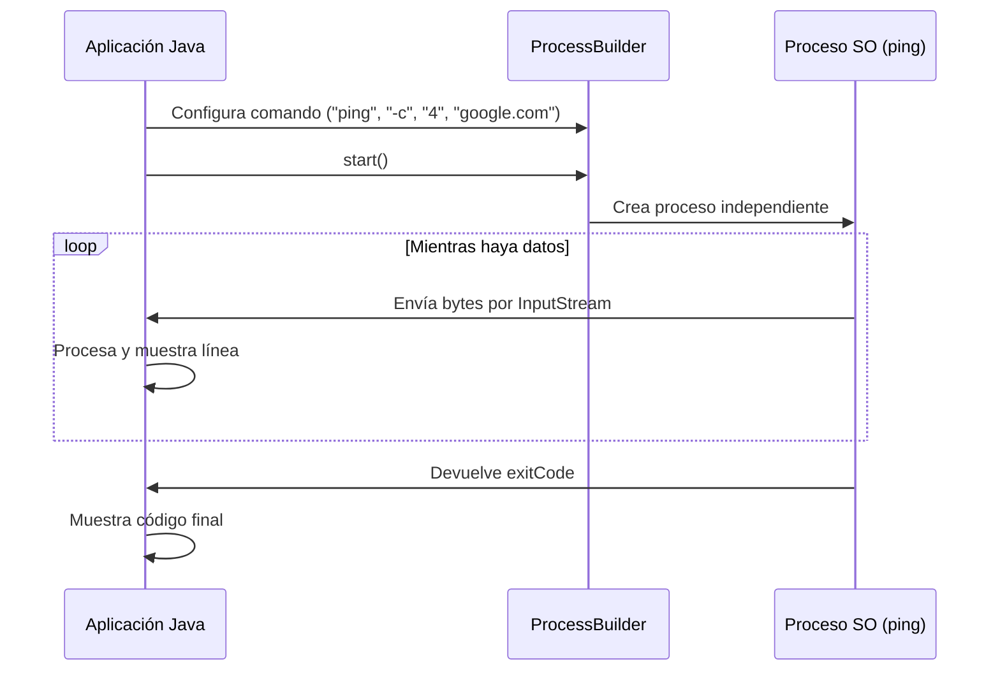

En este tutorial implementaremos una aplicación capaz de lanzar el comando `ping` del sistema operativo, capturar su salida en tiempo real y determinar si el comando finalizó con éxito.

## 1. Prerrequisitos

Este tutorial no requiere dependencias externas. Solo necesitas un entorno de desarrollo Java 17 o superior.

## 2. Diagrama de Flujo

El intercambio de datos entre nuestra aplicación y el proceso del sistema operativo se realiza a través de "tuberías" (pipes).



## 3. Implementación Paso a Paso

### 3.1. Clase LanzadorComandos
Esta clase encapsula toda la lógica de ejecución y lectura.

```java title="src/main/java/com/dam/psp/LanzadorComandos.java"
package com.dam.psp;

import java.io.BufferedReader;
import java.io.InputStreamReader;
import java.io.IOException;

public class LanzadorComandos {

    public static void ejecutarPing(String host) {
        // 1. Configurar el comando según el SO (ping -c 4 en Linux/Mac, ping -n 4 en Windows)
        ProcessBuilder pb = new ProcessBuilder("ping", "-c", "4", host);
        
        try {
            // 2. Iniciar el proceso
            Process proceso = pb.start();

            // 3. Capturar la salida (Standard Output)
            try (BufferedReader reader = new BufferedReader(
                    new InputStreamReader(proceso.getInputStream()))) {
                
                String linea;
                while ((linea = reader.readLine()) != null) {
                    System.out.println("[SALIDA PING]: " + linea);
                }
            }

            // 4. Esperar a que termine y obtener el resultado
            int exitCode = proceso.waitFor();
            System.out.println("\nProceso finalizado con código: " + exitCode);

        } catch (IOException | InterruptedException e) {
            System.err.println("Error en la ejecución: " + e.getMessage());
            Thread.currentThread().interrupt(); // Buena práctica si se interrumpe
        }
    }

    public static void main(String[] args) {
        ejecutarPing("8.8.8.8");
    }
}
```

## 4. Puntos Clave del Código

- **`InputStreamReader`**: Convierte los bytes que envía el SO en caracteres que Java entiende.
- **`BufferedReader`**: Permite leer la salida línea a línea de forma eficiente.
- **`waitFor()`**: Es una llamada bloqueante. El programa no continuará hasta que el comando termine.
- **`exitCode`**: Si es `0`, el comando funcionó. Cualquier otro número indica un error (ej. host no alcanzado).

---

:::tip Actividad
Modifica el código para que la salida de error (si el comando falla o no existe) también sea capturada y mostrada por consola utilizando `pb.redirectErrorStream(true)`.
:::

:::warning
Ten cuidado al ejecutar comandos que nunca terminan (como un ping sin límite). Tu aplicación Java se quedará bloqueada en el bucle `while` indefinidamente.
:::
