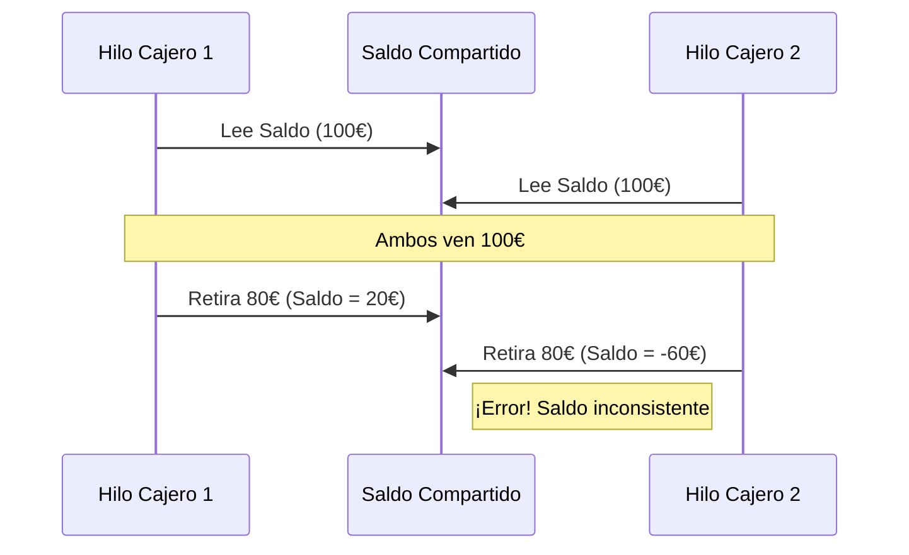

En este tutorial simularemos un sistema de cajeros automáticos donde varios hilos intentan retirar dinero de la misma cuenta simultáneamente. Aprenderemos por qué la sincronización es vital para mantener la integridad de los datos.

## 1. El Problema: Condición de Carrera

Si dos hilos leen el saldo al mismo tiempo, ambos creerán que hay suficiente dinero y permitirán la operación, dejando el saldo en un estado inconsistente (negativo).



## 2. Implementación Paso a Paso

### 2.1. El Recurso Compartido
Creamos la clase `Cuenta` con un método sincronizado.

```java title="src/main/java/com/dam/psp/Cuenta.java"
package com.dam.psp;

public class Cuenta {
    private int saldo = 100;

    public int getSaldo() {
        return saldo;
    }

    // El modificador 'synchronized' asegura que solo un hilo
    // entre aquí a la vez.
    public synchronized void retirarDinero(int cantidad, String nombre) {
        if (saldo >= cantidad) {
            System.out.println(nombre + " va a retirar " + cantidad + "€ (Saldo actual: " + saldo + "€)");
            try {
                Thread.sleep(500); // Simulamos una pequeña pausa de red
            } catch (InterruptedException e) { e.printStackTrace(); }
            
            saldo -= cantidad;
            System.out.println(nombre + " ha retirado el dinero. Nuevo saldo: " + saldo + "€");
        } else {
            System.err.println(nombre + " no puede retirar. Saldo insuficiente (" + saldo + "€)");
        }
    }
}
```

### 2.2. La Tarea del Hilo
Implementamos `Runnable` para definir lo que hará cada cajero.

```java title="src/main/java/com/dam/psp/UsuarioCajero.java"
package com.dam.psp;

public class UsuarioCajero implements Runnable {
    private Cuenta cuenta;

    public UsuarioCajero(Cuenta cuenta) {
        this.cuenta = cuenta;
    }

    @Override
    public void run() {
        for (int i = 0; i < 3; i++) {
            cuenta.retirarDinero(40, Thread.currentThread().getName());
        }
    }
}
```

## 3. Ejecución del Sistema

```java title="src/main/java/com/dam/psp/Main.java"
package com.dam.psp;

public class Main {
    public static void main(String[] args) {
        Cuenta cuentaComun = new Cuenta();
        
        UsuarioCajero tarea = new UsuarioCajero(cuentaComun);

        Thread hilo1 = new Thread(tarea, "Pepe");
        Thread hilo2 = new Thread(tarea, "Maria");

        hilo1.start();
        hilo2.start();
    }
}
```

---

:::tip
Prueba a quitar la palabra clave `synchronized` del método `retirarDinero` y observa cómo el saldo final termina siendo incorrecto.
:::

:::important
La sincronización excesiva puede ralentizar tu aplicación. Úsala solo en los fragmentos de código estrictamente necesarios (secciones críticas).
:::
