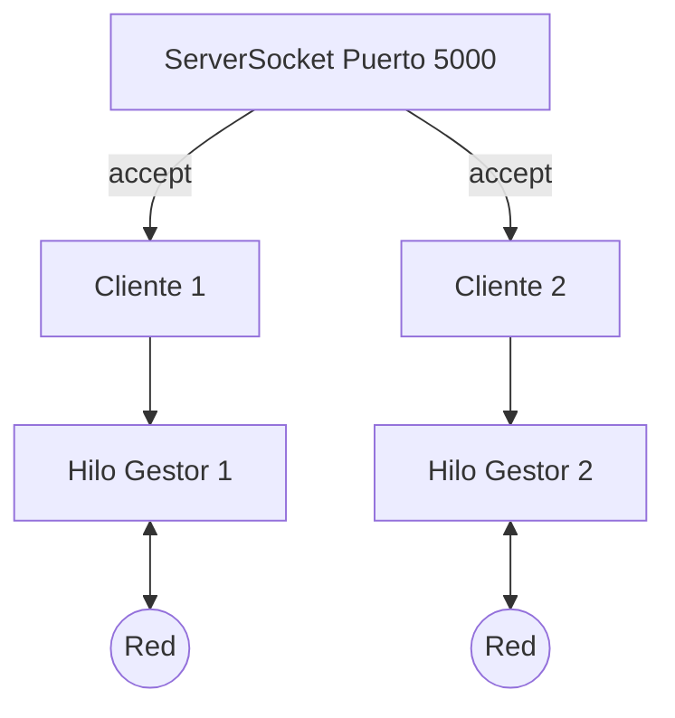

En este tutorial crearemos un servidor de "Eco" que recibe mensajes de los clientes y se los devuelve en mayúsculas. El servidor será capaz de atender a varios clientes al mismo tiempo usando hilos.

## 1. Prerrequisitos

Solo necesitas Java 17+ instalado. No se requieren librerías externas.

## 2. Diagrama de Arquitectura

El servidor utiliza un hilo principal para "escuchar" y delega la comunicación en hilos secundarios.



## 3. Implementación Paso a Paso

### 3.1. El Servidor Multihilo
El servidor acepta conexiones en un bucle infinito.

```java title="src/main/java/com/dam/psp/Servidor.java"
package com.dam.psp;

import java.io.IOException;
import java.net.ServerSocket;
import java.net.Socket;

public class Servidor {
    public static void main(String[] args) {
        int puerto = 5000;
        try (ServerSocket servidor = new ServerSocket(puerto)) {
            System.out.println("Servidor iniciado en el puerto " + puerto);

            while (true) {
                Socket cliente = servidor.accept();
                System.out.println("Cliente conectado: " + cliente.getInetAddress());
                
                // Lanzamos un hilo para atender al cliente
                new Thread(new ManejadorCliente(cliente)).start();
            }
        } catch (IOException e) {
            e.printStackTrace();
        }
    }
}
```

### 3.2. El Manejador del Cliente (Hilo)
Esta clase contiene la lógica de comunicación para cada cliente individual.

```java title="src/main/java/com/dam/psp/ManejadorCliente.java"
package com.dam.psp;

import java.io.*;
import java.net.Socket;

public class ManejadorCliente implements Runnable {
    private Socket socket;

    public ManejadorCliente(Socket socket) {
        this.socket = socket;
    }

    @Override
    public void run() {
        try (DataInputStream in = new DataInputStream(socket.getInputStream());
             DataOutputStream out = new DataOutputStream(socket.getOutputStream())) {
            
            String mensaje = in.readUTF();
            System.out.println("Recibido: " + mensaje);
            
            // Procesamos y respondemos
            out.writeUTF("ECO: " + mensaje.toUpperCase());
            
        } catch (IOException e) {
            e.printStackTrace();
        } finally {
            try { socket.close(); } catch (IOException e) { }
        }
    }
}
```

### 3.3. El Cliente
Un programa sencillo que envía un mensaje y recibe la respuesta.

```java title="src/main/java/com/dam/psp/Cliente.java"
package com.dam.psp;

import java.io.*;
import java.net.Socket;

public class Cliente {
    public static void main(String[] args) {
        try (Socket socket = new Socket("localhost", 5000);
             DataOutputStream out = new DataOutputStream(socket.getOutputStream());
             DataInputStream in = new DataInputStream(socket.getInputStream())) {
            
            out.writeUTF("Hola desde el cliente");
            String respuesta = in.readUTF();
            System.out.println("Servidor dice: " + respuesta);
            
        } catch (IOException e) {
            e.printStackTrace();
        }
    }
}
```

---

:::tip
Para probarlo, primero ejecuta el `Servidor` y luego abre varias terminales para ejecutar el `Cliente` simultáneamente.
:::

:::important
En entornos de producción, se recomienda usar un **Thread Pool** (`Executors.newFixedThreadPool`) en lugar de crear un hilo nuevo con `new Thread()` para cada cliente, evitando así el agotamiento de memoria.
:::
