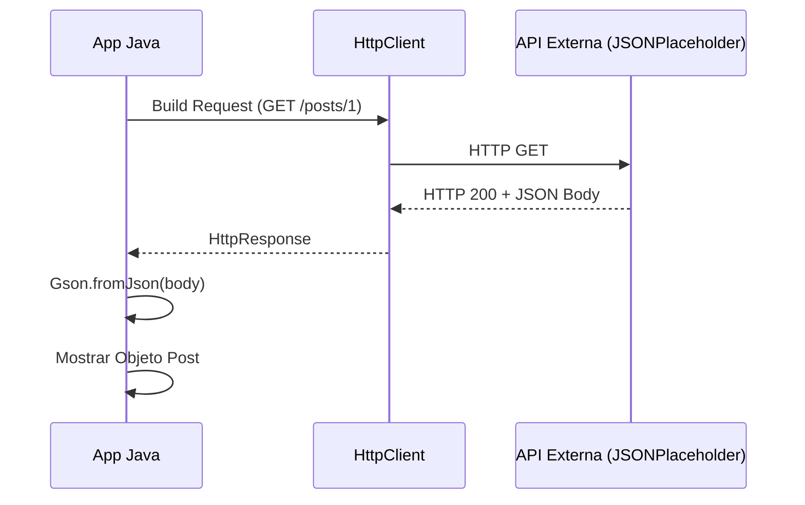

En este tutorial aprenderemos a utilizar el `HttpClient` nativo de Java para consumir datos de una API pública y convertirlos en objetos de nuestra aplicación.

## 1. Prerrequisitos

Utilizaremos la librería **Gson** de Google para convertir el JSON en objetos Java fácilmente. Añade esta dependencia a tu `pom.xml`:

```xml title="pom.xml"
<dependency>
    <groupId>com.google.code.gson</groupId>
    <artifactId>gson</artifactId>
    <version>2.10.1</version>
</dependency>
```

## 2. Diagrama de Flujo



## 3. Implementación Paso a Paso

### 3.1. Modelo de Datos (POJO)
Creamos una clase que coincida con la estructura del JSON que devuelve la API.

```java title="src/main/java/com/dam/psp/model/Post.java"
package com.dam.psp.model;

public class Post {
    private int id;
    private int userId;
    private String title;
    private String body;

    // Getters y toString()
    @Override
    public String toString() {
        return "Post #" + id + ": " + title;
    }
}
```

### 3.2. Cliente de API
Implementamos la lógica para realizar la petición y procesar la respuesta.

```java title="src/main/java/com/dam/psp/ApiClient.java"
package com.dam.psp;

import com.dam.psp.model.Post;
import com.google.gson.Gson;
import java.net.URI;
import java.net.http.HttpClient;
import java.net.http.HttpRequest;
import java.net.http.HttpResponse;

public class ApiClient {
    private static final String API_URL = "https://jsonplaceholder.typicode.com/posts/1";

    public static void main(String[] args) {
        HttpClient client = HttpClient.newHttpClient();
        Gson gson = new Gson();

        HttpRequest request = HttpRequest.newBuilder()
                .uri(URI.create(API_URL))
                .header("Accept", "application/json")
                .GET()
                .build();

        try {
            HttpResponse<String> response = client.send(request, HttpResponse.BodyHandlers.ofString());

            if (response.statusCode() == 200) {
                // Convertir JSON a objeto Java
                Post post = gson.fromJson(response.body(), Post.class);
                System.out.println("Respuesta recibida con éxito:");
                System.out.println(post);
            } else {
                System.err.println("Error en la API. Código: " + response.statusCode());
            }
        } catch (Exception e) {
            e.printStackTrace();
        }
    }
}
```

---

:::tip
El `HttpClient` es inmutable y puede ser reutilizado para múltiples peticiones, lo cual es más eficiente que crear uno nuevo cada vez.
:::

:::important
Cuando trabajes con APIs reales, recuerda siempre manejar los tiempos de espera (timeouts) mediante `.timeout(Duration.ofSeconds(10))` en el Builder de la petición para evitar que tu aplicación se quede colgada.
:::
