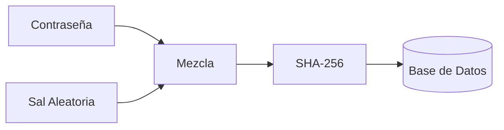

En este tutorial aprenderemos a proteger las contraseñas de nuestros usuarios. **Regla de oro**: Nunca guardes una contraseña en texto plano en la base de datos.

## 1. El concepto de Sal (Salt)

Si dos usuarios tienen la misma contraseña ("1234"), su hash será idéntico. Un atacante podría usar una tabla precalculada para adivinarla. La **Sal** es un valor aleatorio único por cada usuario que se mezcla con la contraseña antes de aplicar el hash, haciendo que el resultado sea siempre diferente.

## 2. Diagrama del Proceso



## 3. Implementación en Java

Utilizaremos la clase `MessageDigest` para generar los hashes.

```java title="src/main/java/com/dam/psp/SeguridadUtil.java"
package com.dam.psp;

import java.security.MessageDigest;
import java.security.NoSuchAlgorithmException;
import java.security.SecureRandom;
import java.util.Base64;

public class SeguridadUtil {

    // 1. Generar una Sal aleatoria
    public static String generarSal() {
        SecureRandom sr = new SecureRandom();
        byte[] salt = new byte[16];
        sr.nextBytes(salt);
        return Base64.getEncoder().encodeToString(salt);
    }

    // 2. Generar el Hash (Contraseña + Sal)
    public static String generarHash(String contraseña, String sal) {
        try {
            MessageDigest md = MessageDigest.getInstance("SHA-256");
            md.update(Base64.getDecoder().decode(sal)); // Añadimos la sal
            byte[] hashBytes = md.digest(contraseña.getBytes());
            return Base64.getEncoder().encodeToString(hashBytes);
        } catch (NoSuchAlgorithmException e) {
            throw new RuntimeException("Algoritmo no encontrado", e);
        }
    }

    public static void main(String[] args) {
        String pass = "mi_clave_segura";
        String sal = generarSal();
        String hash = generarHash(pass, sal);

        System.out.println("Sal (guardar en BD): " + sal);
        System.out.println("Hash (guardar en BD): " + hash);
    }
}
```

## 4. Verificación de la Contraseña

Cuando el usuario intenta hacer login:
1. Recuperas su **Sal** y su **Hash** de la base de datos.
2. Aplicas el método `generarHash(contraseña_introducida, sal_recuperada)`.
3. Comparas el resultado con el **Hash** recuperado de la BD. Si coinciden, la contraseña es correcta.

---

:::tip
Para una seguridad aún mayor en producción, se recomienda usar algoritmos diseñados específicamente para hashing de contraseñas que incluyen factor de coste, como **BCrypt** o **Argon2**.
:::

:::important
Recuerda que `Base64` no es un cifrado, es solo una codificación para poder representar datos binarios como texto. No ofrece ninguna seguridad por sí misma.
:::
