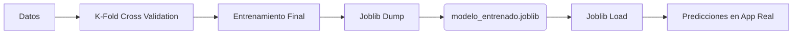

En este tutorial final aprenderemos a asegurar la calidad de nuestro modelo mediante **Validación Cruzada** y a guardarlo en un archivo físico para que pueda ser utilizado por otras aplicaciones sin necesidad de volver a entrenarlo.

## 1. Prerrequisitos

Instala la librería `joblib` si no la tienes:

```bash title="Terminal"
pip install joblib
```

## 2. Diagrama de Persistencia



## 3. Implementación Paso a Paso

### 3.1. Validación Cruzada
Comprobamos que el modelo es estable y no depende de cómo hayamos dividido los datos.

```python title="notebooks/validacion_y_guardado.py"
import joblib
from sklearn.ensemble import RandomForestClassifier
from sklearn.model_selection import cross_val_score
from sklearn.datasets import load_breast_cancer

# 1. Cargar datos
data = load_breast_cancer()
X, y = data.data, data.target

# 2. Crear modelo
modelo = RandomForestClassifier(n_estimators=100, random_state=42)

# 3. Realizar Validación Cruzada (K=5)
scores = cross_val_score(modelo, X, y, cv=5)

print(f"Precisión media: {scores.mean():.4f}")
print(f"Desviación estándar: {scores.std():.4f}")
```

### 3.2. Persistencia (Guardado y Carga)
Una vez validado, entrenamos con todos los datos y guardamos el resultado.

```python title="notebooks/validacion_y_guardado.py"
# 4. Entrenamiento final con todos los datos disponibles
modelo.fit(X, y)

# 5. Guardar el modelo en un archivo
joblib.dump(modelo, 'modelo_cancer.joblib')
print("\nModelo guardado con éxito como 'modelo_cancer.joblib'")

# --- En otra aplicación o script ---

# 6. Cargar el modelo desde el archivo
modelo_cargado = joblib.load('modelo_cancer.joblib')

# 7. Realizar una predicción con datos nuevos
nueva_prediccion = modelo_cargado.predict([X[0]])
print(f"Predicción del modelo cargado: {nueva_prediccion[0]}")
```

## 4. Puntos Clave

- **`cross_val_score`**: Ejecuta todo el proceso de entrenamiento y test K veces automáticamente.
- **`joblib.dump`**: Convierte el objeto Python (el modelo) en un archivo binario.
- **`joblib.load`**: Reconstruye el objeto del modelo exactamente como estaba tras el entrenamiento.

---

:::tip
Utiliza siempre un nombre de archivo descriptivo que incluya la versión o la fecha (ej. `modelo_ventas_v1_2024.joblib`).
:::

:::important
Cuando cargues el modelo en producción, los datos de entrada deben tener exactamente el mismo formato y escala que los datos usados durante el entrenamiento, o las predicciones serán erróneas.
:::
